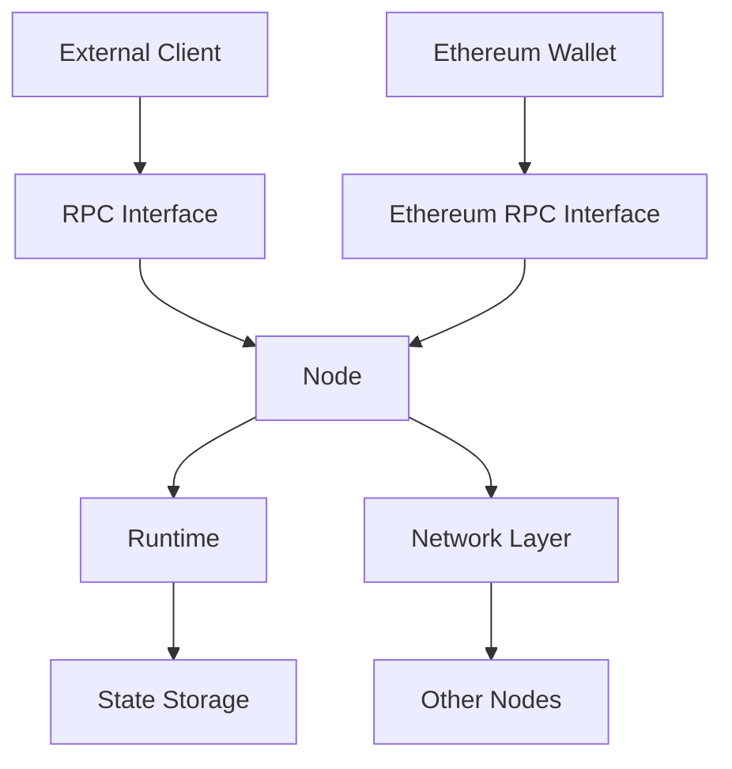

# UBI Chain Architecture

## System Overview

UBI Chain is built on a modular architecture consisting of three main components:

### 1. Node (`ubi-chain-node`)
The node component is responsible for:
- Network communication and consensus
- Block production and validation
- Transaction handling
- State management
- Ethereum JSON-RPC compatibility

### 2. Runtime (`ubi-chain-runtime`)
The runtime module contains:
- Chain state logic
- UBI distribution mechanisms
- Human verification protocols
- Democratic AI access controls
- Transaction execution logic
- Account management

### 3. RPC (`ubi-chain-rpc`)
The RPC interface provides:
- External API access
- Chain state queries
- Transaction submission
- Event subscription
- Ethereum compatibility layer

## Data Flow

## Key Components

### Human Verification System
- Proof of Humanity verification
- Sybil resistance mechanisms
- Identity management

### UBI Distribution
- Token economics (UBI token)
- Distribution algorithms
- Claim verification

### Democratic AI Access
- Resource allocation
- Voting mechanisms
- Access control

### Ethereum Compatibility
- JSON-RPC API implementation
- Chain ID: 2030
- Account creation and management
- Balance queries
- Transaction handling

### Security Architecture
- Cryptographic primitives
- Network security
- State transition validation

## State Management

The chain state includes:
- Account balances
- Identity verification status
- AI resource allocation
- Governance parameters

## Consensus Mechanism

Details about the consensus protocol:
- Block production
- Validator selection
- Finality gadget
- Security assumptions

## Network Protocol

Network communication details:
- P2P protocol
- Message types
- Network topology
- Peer discovery
- Node pairing

## Account System

The account system provides:
- Automatic account creation
- Balance management
- UBI token distribution
- Human verification status
- Ethereum address compatibility

## Future Considerations

Planned architectural improvements:
- Scalability enhancements
- Cross-chain integration
- Privacy features
- Governance mechanisms
- Enhanced Ethereum compatibility 